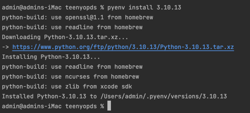
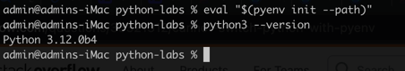

## Install the latest release of Python 3 using `pyenv`

### 1. Install `pyenv`

If you haven't already installed pyenv, you can do so using a package manager like brew (on macOS) or by cloning the GitHub repository.

On macOS using Homebrew:

```shell
brew update
brew install pyenv
```

On Linux (Ubuntu) using apt:

```shell
sudo apt update
sudo apt install pyenv
```

For other installation methods or platforms, you can refer to the official pyenv documentation: https://github.com/pyenv/pyenv#installation

### 2. Install dependencies

`pyenv` might require some additional dependencies for building Python.
On Ubuntu, you can install them with the following command:

```shell
sudo apt-get install -y make build-essential libssl-dev zlib1g-dev \
  libbz2-dev libreadline-dev libsqlite3-dev wget curl llvm \
  libncurses5-dev xz-utils tk-dev libxml2-dev libxmlsec1-dev libffi-dev liblzma-dev
```

### 3. List available Python versions

You can list the available Python versions using the following command:

```shell
pyenv install --list
```

### 4. Install the latest Python 3

To install the latest release of Python 3, you can use the following command:

```shell
pyenv install $(pyenv install --list | grep -E "^\s*3\.\d+\.\d+" | tail -1)
```

This command uses a combination of `grep` and `tail` to find the latest Python 3 version from the list of available versions and then passes it to `pyenv install`.

#### Install a specific version of Python

```bash
pyenv install <version>
```

Replace `<version>` with the specific version you want to install, like `3.10.13`.



### 5. Set global or local Python versions

Once you've installed the latest Python 3 version, you can set it as the global default, or for a specific project, using `pyenv global` or `pyenv local`.

To set it globally:

```shell
pyenv global <python_version>
```

To set it locally within a directory (this creates a `.python-version` file in that directory):

```shell
pyenv local <python_version>
```

Replace `<python_version>` with the actual version number you want to use, like `3.10.13`.

### 6. Initialize the `pyenv` path

```shell
eval "$(pyenv init --path)"
```



After these steps, you should have the latest release of Python 3 installed using `pyenv`.
You can verify the installation by running `python --version`.
